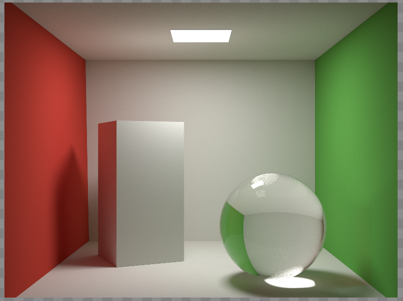
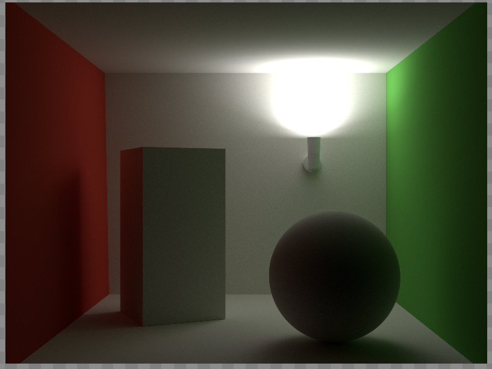

# Bidirectional-Path-Tracing

This project extends a rendering framework provided by McGills ECSE 446/546 course to provide Bidirectional Path Tracing and the implementation of perfect mirrors and transmissive materials. This means that there is support for light transport for paths with delta distributions like specular reflection and refraction. 

The implementation of BDPT leverages Multiple Importance Sampling as described in Eric Veach's thesis to use multiple path sampling strategies and combine them to reduce variance. Paths for either the light or eye subpaths are terminated in an unbiased stochastic manner using Russian Roulette where the threshold probability is based on the throughput of the path. The implementation for MIS weight tracking is from the paper on Vertex Connection and Merging by Iliyan Georgiev. Following is the 2 resources used while implementing BDPT:
http://www.iliyan.com/publications/ImplementingVCM/ImplementingVCM_TechRep2012_rev2.pdf
http://graphics.stanford.edu/papers/veach_thesis/thesis.pdf

The reduction in variance allows BDPT to converge to visually acceptable results in a much shorter time than 
traditional path or light tracing. Below are 2 sample images that were rendered that would otherwise contain high frequency noise in
the form of fireflies if done with traditional path tracing.

The primary files of interest are:
https://github.com/JackMinn/Bidirectional-Path-Tracing/blob/master/src/integrators/bdpt.h
https://github.com/JackMinn/Bidirectional-Path-Tracing/blob/master/src/bsdfs/perfectmirror.h
https://github.com/JackMinn/Bidirectional-Path-Tracing/blob/master/src/bsdfs/glass.h

Additional edits were made to support the new integrator and material models in the overall framework, as well as to support multi-threading with a threadsafe frame buffer. The rest of the code was provided by McGill.

